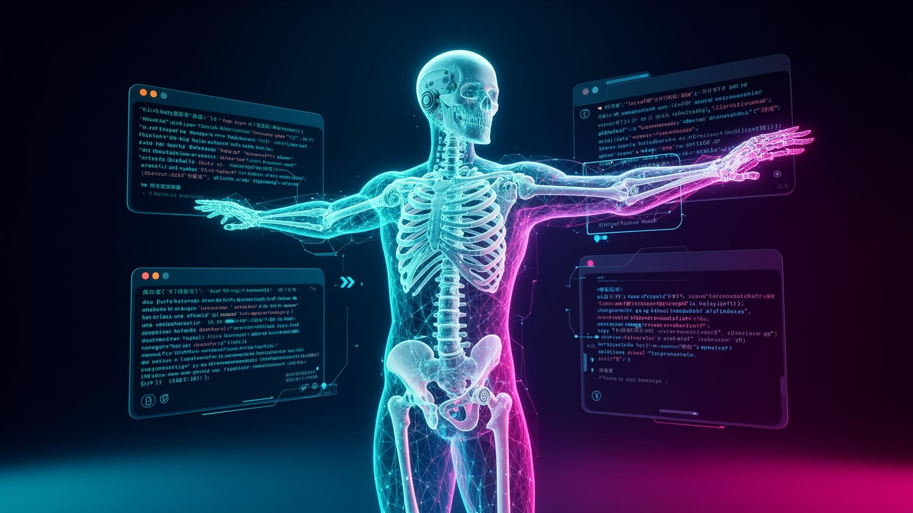
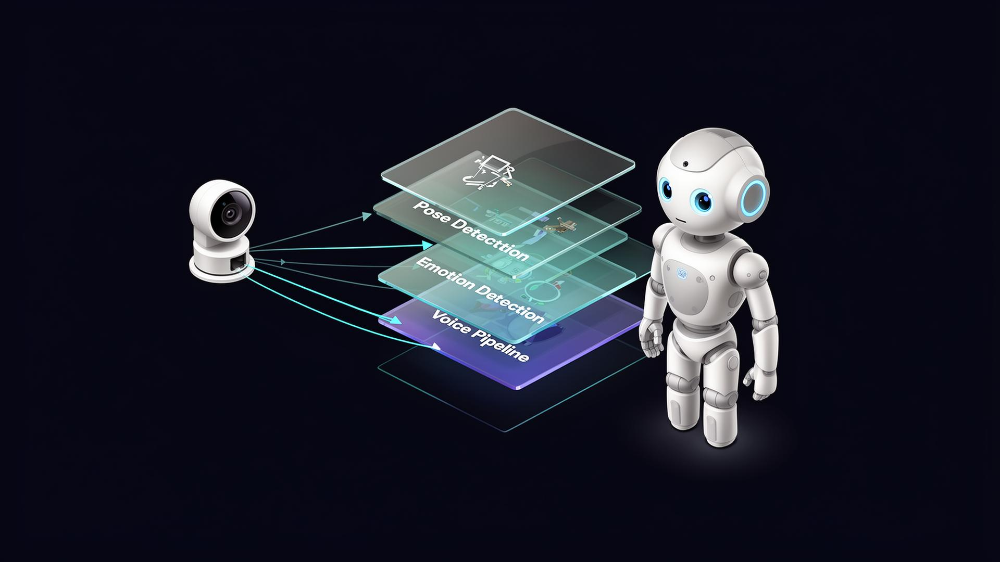

# Simulated Self — Human-Robot Interaction

> A real-time, browser-native digital twin: your webcam drives a 3D humanoid that
> mirrors your pose, reads your emotion, and chats back through a streaming
> Llama 3.1 voice pipeline.

<p align="center">
  
</p>

<p align="center">
  <a href="#quick-start"></a>
  
  
  
</p>

---

## ✦ What it does

Simulated Self turns any webcam into a full‑body, full‑face, full‑voice
interaction surface. The system fuses three independent perception pipelines
with a streaming language model and renders the result as a 3D humanoid in
real time.

| Capability                | Tech                                               | Latency target |
|---------------------------|----------------------------------------------------|----------------|
| 33-point body pose        | MediaPipe Pose / Holistic                          | < 33 ms / frame |
| 21-point hand tracking    | MediaPipe Hands                                    | < 33 ms / frame |
| 7-class facial emotion    | face-api.js (TinyFaceDetector + expression net)    | < 80 ms / frame |
| Streaming voice chat      | Web Speech API → Groq Llama 3.1 → SpeechSynthesis  | First token < 600 ms |
| 3D humanoid rendering     | Three.js + custom skeletal retargeting             | 60 fps          |

## ✦ Highlights

- **Streaming AI replies.** Tokens appear in the glass HUD as they arrive — no
  more waiting for a full response.
- **Bulletproof voice pipeline.** Explicit `idle → listening → processing →
  streaming → speaking → error` state machine with timeout, retry, and cancel.
- **Apple-grade UI.** Backdrop-blur glass panels, animated status rings,
  monospace caret, accessible color contrast.
- **Privacy by design.** All vision pipelines run locally in the browser;
  nothing is uploaded. Only the spoken prompt text leaves the device, and only
  to the configured AI endpoint.
- **Secrets stay out of the repo.** API keys live in `.env.local`
  (gitignored). For production, proxy through a Lovable Cloud edge function.

<p align="center">
  
</p>

## ✦ Quick start

```bash
# 1. Install
bun install        # or: npm install

# 2. Configure secrets
cp .env.example .env.local
# Edit .env.local and paste your Groq API key (get one at https://console.groq.com)

# 3. Run
bun run dev        # or: npm run dev
```

Open the preview URL, grant **camera + microphone** permission, and stand back
from the camera so your full body is visible. Tap the 🎤 button to talk.

## ✦ Documentation

The `docs/` folder contains engineering-grade documentation:

| Doc                                          | Purpose                                           |
|----------------------------------------------|---------------------------------------------------|
| [`docs/ARCHITECTURE.md`](docs/ARCHITECTURE.md) | System diagram, module responsibilities, data flow |
| [`docs/VOICE_PIPELINE.md`](docs/VOICE_PIPELINE.md) | Streaming, retry, timeout, and TTS contract       |
| [`docs/RESEARCH.md`](docs/RESEARCH.md)         | Research-style report: methodology, limitations, comparisons across Human Modeling/Augmentation and Sensory/Motor Extension |
| [`docs/SECURITY.md`](docs/SECURITY.md)         | Key handling, browser exposure model, hardening   |
| [`docs/CONTRIBUTING.md`](docs/CONTRIBUTING.md) | Coding conventions, commit hygiene, review bar    |

## ✦ Tech stack

- **Runtime** — Vite 5, React 18, TypeScript 5
- **3D** — Three.js, custom skeleton retargeting (`src/components/SkeletonRenderer.tsx`)
- **Vision** — `@mediapipe/holistic`, `face-api.js`
- **AI** — `groq-sdk`, model `llama-3.1-8b-instant` (streaming)
- **Voice I/O** — Web Speech API (recognition + synthesis)
- **UI** — Tailwind CSS, shadcn/ui, glass-morphism design tokens

## ✦ License & credit

Built and maintained by **Min Htet Myet** — ML Engineer, MLOps practitioner,
Local Chapter Lead at Omdena Myanmar, NASA Virtual Guest alum.

Released under the MIT License. See [`LICENSE`](LICENSE) for details.
